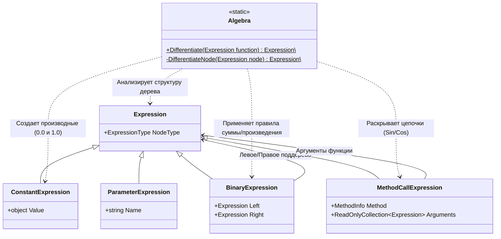

```mermaid
classDiagram
    %% Основной статический класс мат. логики
    class Algebra {
        <<static>>
        +Differentiate(Expression function) Expression\$
        -DifferentiateNode(Expression node) Expression\$
    }

    %% Kлассы LINQ Expressions, которые разбирает алгоритм
    class Expression {
        +ExpressionType NodeType
    }

    class ConstantExpression {
        +object Value
    }
    Expression <|-- ConstantExpression

    class ParameterExpression {
        +string Name
    }
    Expression <|-- ParameterExpression

    class BinaryExpression {
        +Expression Left
        +Expression Right
    }
    Expression <|-- BinaryExpression

    class MethodCallExpression {
        +MethodInfo Method
        +ReadOnlyCollection~Expression~ Arguments
    }
    Expression <|-- MethodCallExpression

    %% Определение структурных отношений и рекурсии
    BinaryExpression --> Expression : Левое/Правое поддерево
    MethodCallExpression --> Expression : Аргументы функции

    %% Зависимости дифференцирования
    Algebra ..> Expression : Анализирует структуру дерева
    Algebra ..> ConstantExpression : Создает производные (0.0 и 1.0)
    Algebra ..> BinaryExpression : Применяет правила суммы/произведения
    Algebra ..> MethodCallExpression : Раскрывает цепочки (Sin/Cos)
```
