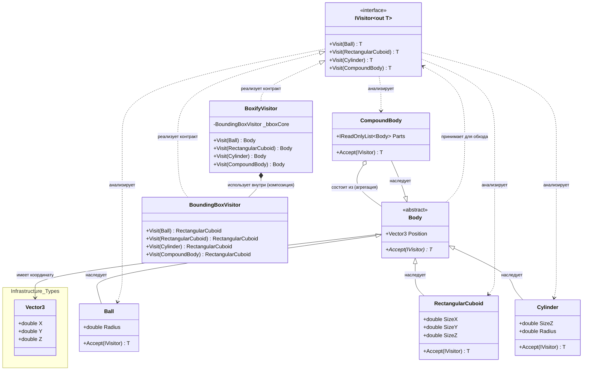

```mermaid
classDiagram
    direction TB

    %% Внешние вспомогательные структуры данных
    namespace Infrastructure_Types {
        class Vector3 {
            +double X
            +double Y
            +double Z
        }
    }

    %% Интерфейсы посетителя
    class IVisitor~out T~ {
        <<interface>>
        +Visit(Ball) T
        +Visit(RectangularCuboid) T
        +Visit(Cylinder) T
        +Visit(CompoundBody) T
    }

    %% Базовый абстрактный класс геометрического тела
    class Body {
        <<abstract>>
        +Vector3 Position
        +Accept(IVisitor) T*
    }
    Body --> Vector3 : <small>имеет координату</small>

    %% Конкретные геометрические тела
    class Ball {
        +double Radius
        +Accept(IVisitor) T
    }
    Body <|-- Ball : <small>наследует</small>

    class RectangularCuboid {
        +double SizeX
        +double SizeY
        +double SizeZ
        +Accept(IVisitor) T
    }
    Body <|-- RectangularCuboid : <small>наследует</small>

    class Cylinder {
        +double SizeZ
        +double Radius
        +Accept(IVisitor) T
    }
    Body <|-- Cylinder : <small>наследует</small>

    class CompoundBody {
        +IReadOnlyList~Body~ Parts
        +Accept(IVisitor) T
    }
    Body <|-- CompoundBody : <small>наследует</small>
    CompoundBody o-- Body : <small>состоит из (агрегация)</small>

    %% Реализации посетителей
    class BoundingBoxVisitor {
        +Visit(Ball) RectangularCuboid
        +Visit(RectangularCuboid) RectangularCuboid
        +Visit(Cylinder) RectangularCuboid
        +Visit(CompoundBody) RectangularCuboid
    }
    IVisitor <|.. BoundingBoxVisitor : <small>реализует контракт</small>

    class BoxifyVisitor {
        -BoundingBoxVisitor _bboxCore
        +Visit(Ball) Body
        +Visit(RectangularCuboid) Body
        +Visit(Cylinder) Body
        +Visit(CompoundBody) Body
    }
    IVisitor <|.. BoxifyVisitor : <small>реализует контракт</small>
    BoxifyVisitor *-- BoundingBoxVisitor : <small>использует внутри (композиция)</small>

    %% Зависимости логики 
    Body ..> IVisitor : <small>принимает для обхода</small>
    IVisitor ..> Ball : <small>анализирует</small>
    IVisitor ..> RectangularCuboid : <small>анализирует</small>
    IVisitor ..> Cylinder : <small>анализирует</small>
    IVisitor ..> CompoundBody : <small>анализирует</small>
```
