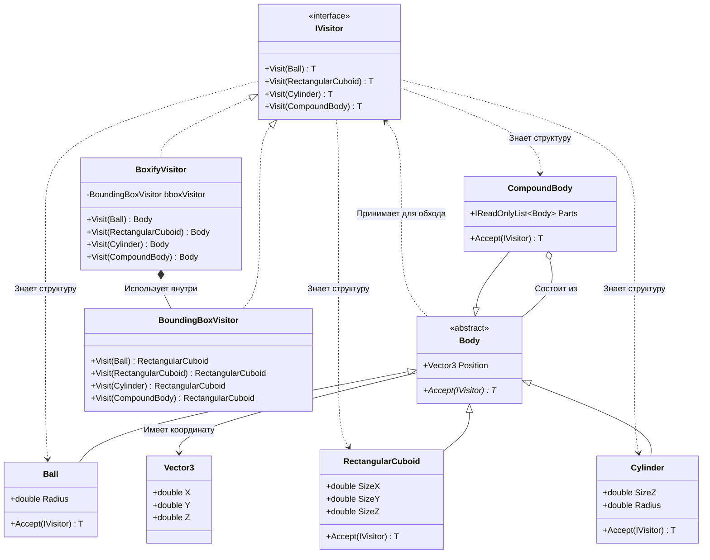

```mermaid
classDiagram
    %% Внешние структуры
    class Vector3 {
        +double X
        +double Y
        +double Z
    }

    %% Интерфейсы
    class IVisitor {
        <<interface>>
        +Visit(Ball) T
        +Visit(RectangularCuboid) T
        +Visit(Cylinder) T
        +Visit(CompoundBody) T
    }

    %% Базовый абстрактный класс геометрического тела
    class Body {
        <<abstract>>
        +Vector3 Position
        +Accept(IVisitor) T*
    }
    Body --> Vector3 : Имеет координату

    %% Геометрические тела
    class Ball {
        +double Radius
        +Accept(IVisitor) T
    }
    Body <|-- Ball

    class RectangularCuboid {
        +double SizeX
        +double SizeY
        +double SizeZ
        +Accept(IVisitor) T
    }
    Body <|-- RectangularCuboid

    class Cylinder {
        +double SizeZ
        +double Radius
        +Accept(IVisitor) T
    }
    Body <|-- Cylinder

    class CompoundBody {
        +IReadOnlyList~Body~ Parts
        +Accept(IVisitor) T
    }
    Body <|-- CompoundBody
    CompoundBody o-- Body : Состоит из

    %% Посетители
    class BoundingBoxVisitor {
        +Visit(Ball) RectangularCuboid
        +Visit(RectangularCuboid) RectangularCuboid
        +Visit(Cylinder) RectangularCuboid
        +Visit(CompoundBody) RectangularCuboid
    }
    IVisitor <|.. BoundingBoxVisitor

    class BoxifyVisitor {
        -BoundingBoxVisitor bboxVisitor
        +Visit(Ball) Body
        +Visit(RectangularCuboid) Body
        +Visit(Cylinder) Body
        +Visit(CompoundBody) Body
    }
    IVisitor <|.. BoxifyVisitor
    BoxifyVisitor *-- BoundingBoxVisitor : Использует внутри

    
    Body ..> IVisitor : Принимает для обхода
    IVisitor ..> Ball : Знает структуру
    IVisitor ..> RectangularCuboid : Знает структуру
    IVisitor ..> Cylinder : Знает структуру
    IVisitor ..> CompoundBody : Знает структуру
```
