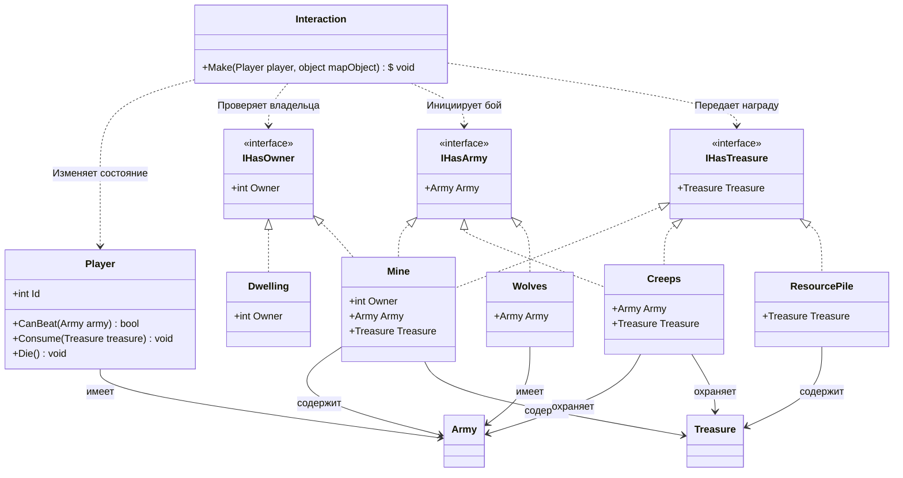

```mermaid
classDiagram
    %% Определение интерфейсов
    class IHasOwner {
        <<interface>>
        +int Owner
    }
    class IHasArmy {
        <<interface>>
        +Army Army
    }
    class IHasTreasure {
        <<interface>>
        +Treasure Treasure
    }

    %% Реализация интерфейсов классами
    class Dwelling {
        +int Owner
    }
    IHasOwner <|.. Dwelling

    class Mine {
        +int Owner
        +Army Army
        +Treasure Treasure
    }
    IHasOwner <|.. Mine
    IHasArmy <|.. Mine
    IHasTreasure <|.. Mine

    class Creeps {
        +Army Army
        +Treasure Treasure
    }
    IHasArmy <|.. Creeps
    IHasTreasure <|.. Creeps

    class Wolves {
        +Army Army
    }
    IHasArmy <|.. Wolves

    class ResourcePile {
        +Treasure Treasure
    }
    IHasTreasure <|.. ResourcePile

    %% Сущности предметной области
    class Player {
        +int Id
        +CanBeat(Army army) bool
        +Consume(Treasure treasure) void
        +Die() void
    }

    class Army
    class Treasure

    %% Структурные связи
    Player --> Army : имеет
    Mine --> Army : содержит
    Mine --> Treasure : содержит
    Creeps --> Army : охраняет
    Creeps --> Treasure : охраняет
    Wolves --> Army : имеет
    ResourcePile --> Treasure : содержит

    %% Статический класс для взаимодействия
    class Interaction {
        +Make(Player player, object mapObject)\$ void
    }

    %% Зависимости для логики взаимодействия
    Interaction ..> Player : Изменяет состояние
    Interaction ..> IHasOwner : Проверяет владельца
    Interaction ..> IHasArmy : Инициирует бой
    Interaction ..> IHasTreasure : Передает награду
```
