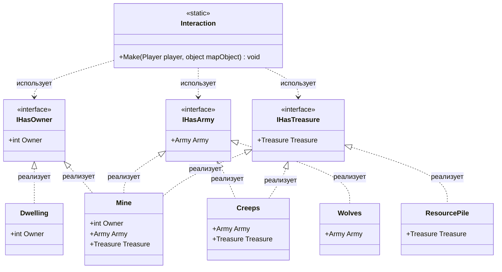

```mermaid
classDiagram
    %% --- ИНТЕРФЕЙСЫ КОМПОНЕНТОВ ---
    class IHasOwner {
        <<interface>>
        +int Owner
    }
    class IHasArmy {
        <<interface>>
        +Army Army
    }
    class IHasTreasure {
        <<interface>>
        +Treasure Treasure
    }

    %% --- ИГРОВЫЕ ОБЪЕКТЫ ---
    class Dwelling {
        +int Owner
    }
    IHasOwner <|.. Dwelling : реализует

    class Mine {
        +int Owner
        +Army Army
        +Treasure Treasure
    }
    IHasOwner <|.. Mine : реализует
    IHasArmy <|.. Mine : реализует
    IHasTreasure <|.. Mine : реализует

    class Creeps {
        +Army Army
        +Treasure Treasure
    }
    IHasArmy <|.. Creeps : реализует
    IHasTreasure <|.. Creeps : реализует

    class Wolves {
        +Army Army
    }
    IHasArmy <|.. Wolves : реализует

    class ResourcePile {
        +Treasure Treasure
    }
    IHasTreasure <|.. ResourcePile : реализует

    %% --- СЕРВИС ---
    class Interaction {
        <<static>>
        +Make(Player player, object mapObject) void
    }
    Interaction ..> IHasOwner : использует
    Interaction ..> IHasArmy : использует
    Interaction ..> IHasTreasure : использует

```