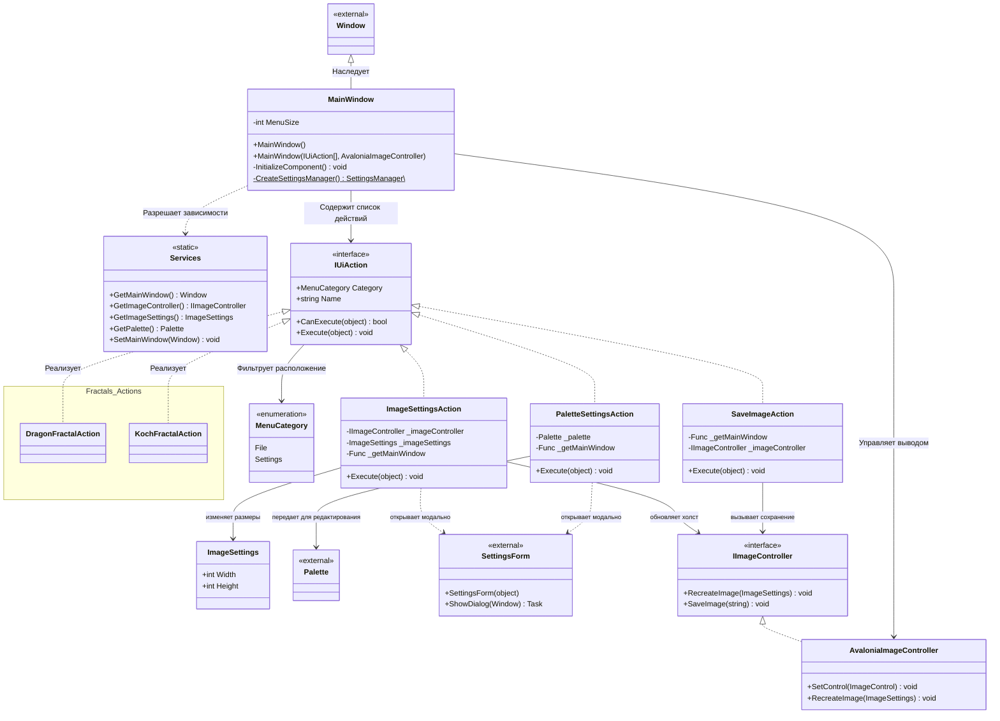

```mermaid
classDiagram
    direction TB
    
    %% Базовые типы и инфраструктура
    class Window { <<external>> }
    class MenuCategory {
        <<enumeration>>
        File
        Settings
    }
    class Services {
        <<static>>
        +GetMainWindow() Window
        +GetImageController() IImageController
        +GetImageSettings() ImageSettings
        +GetPalette() Palette
        +SetMainWindow(Window) void
    }

    %% Клиентская часть приложения (Окна)
    class MainWindow {
        -int MenuSize
        +MainWindow()
        +MainWindow(IUiAction[], AvaloniaImageController)
        -InitializeComponent() void
        -CreateSettingsManager() SettingsManager\$
    }
    Window <|-- MainWindow : Наследует
    MainWindow ..> Services : Разрешает зависимости

    class IUiAction {
        <<interface>>
        +MenuCategory Category
        +string Name
        +CanExecute(object) bool
        +Execute(object) void
    }
    MainWindow --> IUiAction : Содержит список действий
    IUiAction --> MenuCategory : Фильтрует расположение

    %% Именованные действия UI (Реализации интерфейса экшенов)
    class ImageSettingsAction {
        -IImageController _imageController
        -ImageSettings _imageSettings
        -Func _getMainWindow
        +Execute(object) void
    }
    class SaveImageAction {
        -Func _getMainWindow
        -IImageController _imageController
        +Execute(object) void
    }
    class PaletteSettingsAction {
        -Palette _palette
        -Func _getMainWindow
        +Execute(object) void
    }
    
    IUiAction <|.. ImageSettingsAction
    IUiAction <|.. SaveImageAction
    IUiAction <|.. PaletteSettingsAction

    %% Новые фрактальные экшены, найденные в коде вашего конструктора MainWindow
    namespace Fractals_Actions {
        class DragonFractalAction
        class KochFractalAction
    }
    IUiAction <|.. DragonFractalAction : Реализует
    IUiAction <|.. KochFractalAction : Реализует

    %% Доменная модель и формы настроек
    class ImageSettings {
        +int Width
        +int Height
    }
    class Palette { <<external>> }
    class SettingsForm {
        <<external>>
        +SettingsForm(object)
        +ShowDialog(Window) Task
    }

    class IImageController {
        <<interface>>
        +RecreateImage(ImageSettings) void
        +SaveImage(string) void
    }
    class AvaloniaImageController {
        +SetControl(ImageControl) void
        +RecreateImage(ImageSettings) void
    }
    IImageController <|.. AvaloniaImageController
    MainWindow --> AvaloniaImageController : Управляет выводом

    %% Стабильные связи нижнего уровня с мелким шрифтом
    ImageSettingsAction --> IImageController : <small>обновляет холст</small>
    ImageSettingsAction --> ImageSettings : <small>изменяет размеры</small>
    ImageSettingsAction ..> SettingsForm : <small>открывает модально</small>
    
    SaveImageAction --> IImageController : <small>вызывает сохранение</small>
    
    PaletteSettingsAction --> Palette : <small>передает для редактирования</small>
    PaletteSettingsAction ..> SettingsForm : <small>открывает модально</small>
```
