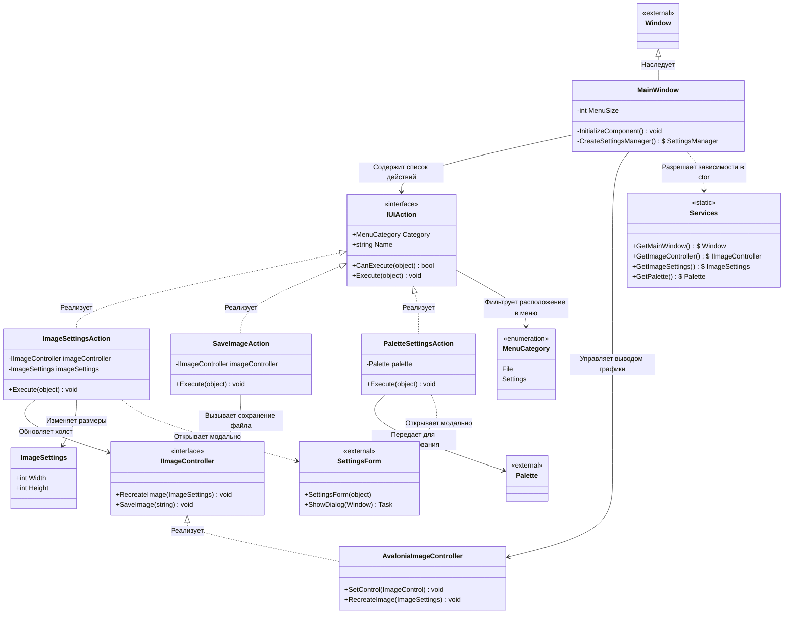

```mermaid
classDiagram
    %% Базовые интерфейсы и перечисления
    class IUiAction {
        <<interface>>
        +MenuCategory Category
        +string Name
        +CanExecute(object) bool
        +Execute(object) void
    }

    class MenuCategory {
        <<enumeration>>
        File
        Settings
    }

    %% Компоненты UI 
    class Window {
        <<external>>
    }
    class MainWindow {
        -int MenuSize
        -InitializeComponent() void
        -CreateSettingsManager()\$ SettingsManager
    }
    Window <|-- MainWindow : Наследует

    class SettingsForm {
        <<external>>
        +SettingsForm(object)
        +ShowDialog(Window) Task
    }

    %% Реализации IUiAction
    class ImageSettingsAction {
        -IImageController imageController
        -ImageSettings imageSettings
        +Execute(object) void
    }
    IUiAction <|.. ImageSettingsAction : Реализует

    class SaveImageAction {
        -IImageController imageController
        +Execute(object) void
    }
    IUiAction <|.. SaveImageAction : Реализует

    class PaletteSettingsAction {
        -Palette palette
        +Execute(object) void
    }
    IUiAction <|.. PaletteSettingsAction : Реализует

    %% Внешние доменные сущности 
    class IImageController {
        <<interface>>
        +RecreateImage(ImageSettings) void
        +SaveImage(string) void
    }
    
    class AvaloniaImageController {
        +SetControl(ImageControl) void
        +RecreateImage(ImageSettings) void
    }
    IImageController <|.. AvaloniaImageController : Реализует

    class ImageSettings {
        +int Width
        +int Height
    }
    class Palette {
        <<external>>
    }
    
    class Services {
        <<static>>
        +GetMainWindow()\$ Window
        +GetImageController()\$ IImageController
        +GetImageSettings()\$ ImageSettings
        +GetPalette()\$ Palette
    }

    %% Связи композиции и агрегации 
    MainWindow --> IUiAction : Содержит список действий
    MainWindow --> AvaloniaImageController : Управляет выводом графики

    %% Связи зависимостей действий
    ImageSettingsAction --> IImageController : Обновляет холст
    ImageSettingsAction --> ImageSettings : Изменяет размеры
    ImageSettingsAction ..> SettingsForm : Открывает модально
    
    SaveImageAction --> IImageController : Вызывает сохранение файла
    
    PaletteSettingsAction --> Palette : Передает для редактирования
    PaletteSettingsAction ..> SettingsForm : Открывает модально

    %% Использование глобального сервис-локатора
    MainWindow ..> Services : Разрешает зависимости в ctor
    IUiAction --> MenuCategory : Фильтрует расположение в меню
```
