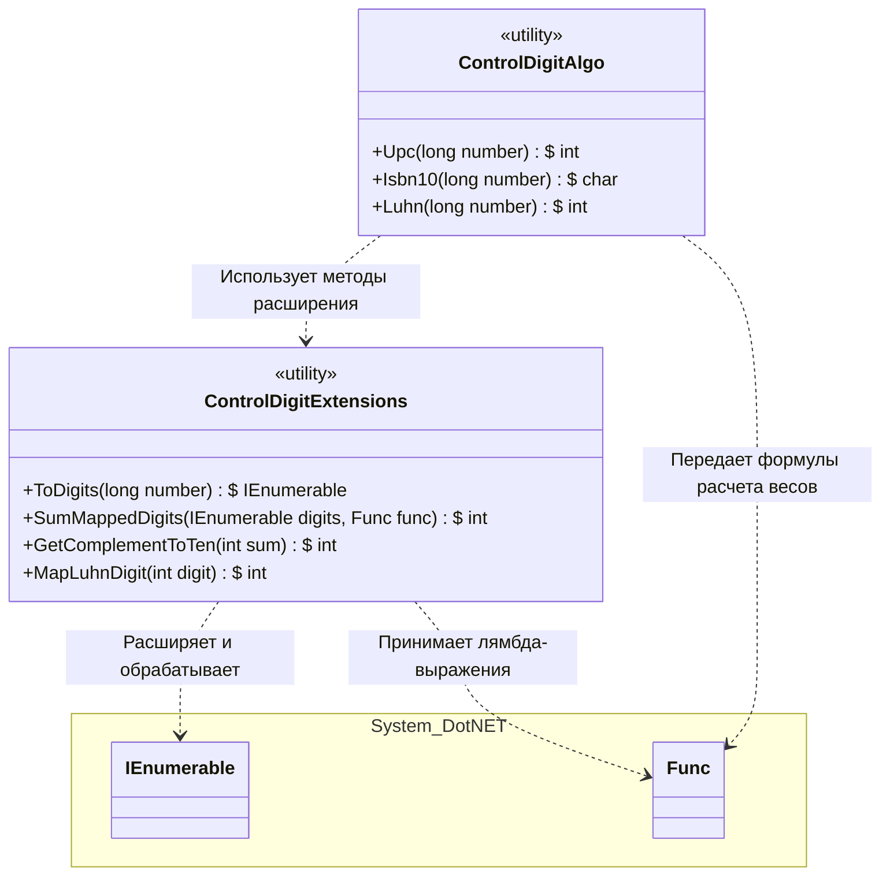

```mermaid
classDiagram
    %% Статический класс основных алгоритмов
    class ControlDigitAlgo {
        <<utility>>
        +Upc(long number)\$ int
        +Isbn10(long number)\$ char
        +Luhn(long number)\$ int
    }

    %% Статический класс с методами расширения для коллекций
    class ControlDigitExtensions {
        <<utility>>
        +ToDigits(long number)\$ IEnumerable
        +SumMappedDigits(IEnumerable digits, Func func)\$ int
        +GetComplementToTen(int sum)\$ int
        +MapLuhnDigit(int digit)\$ int
    }

    %% Группировка внешних зависимостей .NET 
    namespace System_DotNET {
        class IEnumerable
        class Func
    }

    %% Связи зависимостей и использования методов расширения
    ControlDigitAlgo ..> ControlDigitExtensions : Использует методы расширения
    ControlDigitExtensions ..> IEnumerable : Расширяет и обрабатывает
    ControlDigitExtensions ..> Func : Принимает лямбда-выражения
    
    %% Логические зависимости алгоритмов от функций высшего порядка
    ControlDigitAlgo ..> Func : Передает формулы расчета весов
```
