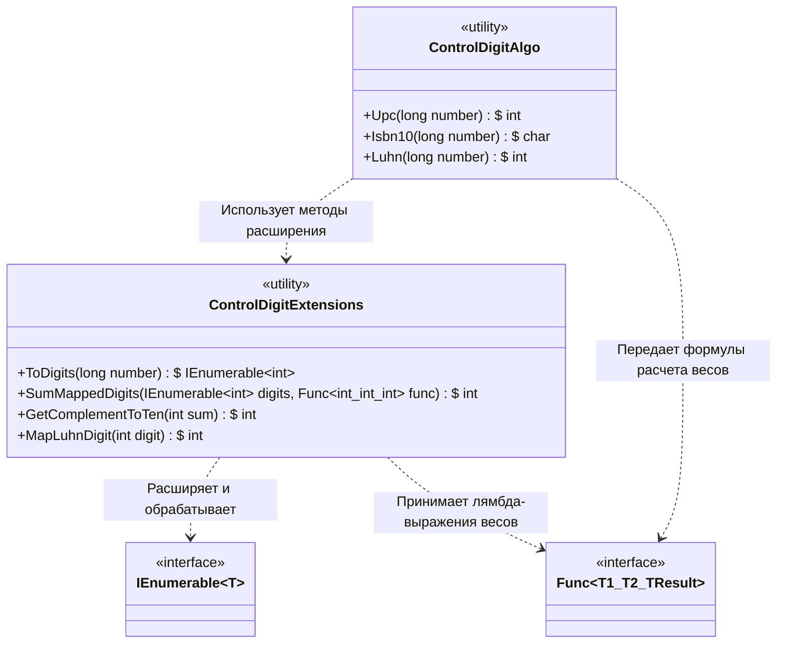

```mermaid
classDiagram
    %% Статический класс основных алгоритмов
    class ControlDigitAlgo {
        <<utility>>
        +Upc(long number)\$ int
        +Isbn10(long number)\$ char
        +Luhn(long number)\$ int
    }

    %% Статический класс с методами расширения для коллекций
    class ControlDigitExtensions {
        <<utility>>
        +ToDigits(long number)\$ IEnumerable~int~
        +SumMappedDigits(IEnumerable~int~ digits, Func~int_int_int~ func)\$ int
        +GetComplementToTen(int sum)\$ int
        +MapLuhnDigit(int digit)\$ int
    }

    %% Системные зависимости .NET, воспользованные в архитектуре
    class IEnumerable~T~ {
        <<interface>>
    }

    class Func~T1_T2_TResult~ {
        <<interface>>
    }

    %% Связи зависимостей и методов расширения
    ControlDigitAlgo ..> ControlDigitExtensions : Использует методы расширения
    ControlDigitExtensions ..> IEnumerable~T~ : Расширяет и обрабатывает
    ControlDigitExtensions ..> Func~T1_T2_TResult~ : Принимает лямбда-выражения весов
    
    %% Логические зависимости самих алгоритмов от функций высшего порядка
    ControlDigitAlgo ..> Func~T1_T2_TResult~ : Передает формулы расчета весов
```
