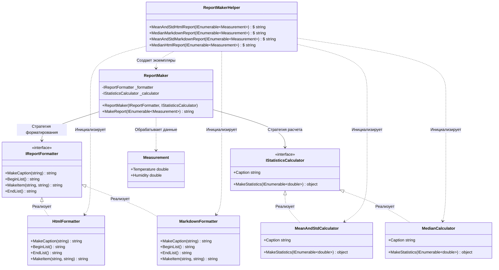

```mermaid
classDiagram
    %% Интерфейсы
    class IReportFormatter {
        <<interface>>
        +MakeCaption(string) string
        +BeginList() string
        +MakeItem(string, string) string
        +EndList() string
    }

    class IStatisticsCalculator {
        <<interface>>
        +Caption string
        +MakeStatistics(IEnumerable~double~) object
    }

    %% Интерфейс форматирования
    class HtmlFormatter {
        +MakeCaption(string) string
        +BeginList() string
        +EndList() string
        +MakeItem(string, string) string
    }
    IReportFormatter <|.. HtmlFormatter : Реализует

    class MarkdownFormatter {
        +MakeCaption(string) string
        +BeginList() string
        +EndList() string
        +MakeItem(string, string) string
    }
    IReportFormatter <|.. MarkdownFormatter : Реализует

    %% Интерфейс калькулятора
    class MeanAndStdCalculator {
        +Caption string
        +MakeStatistics(IEnumerable~double~) object
    }
    IStatisticsCalculator <|.. MeanAndStdCalculator : Реализует

    class MedianCalculator {
        +Caption string
        +MakeStatistics(IEnumerable~double~) object
    }
    IStatisticsCalculator <|.. MedianCalculator : Реализует

    %% Класс данных
    class Measurement {
        +Temperature double
        +Humidity double
    }

    %% Основной класс генератора отчетов
    class ReportMaker {
        -IReportFormatter _formatter
        -IStatisticsCalculator _calculator
        +ReportMaker(IReportFormatter, IStatisticsCalculator)
        +MakeReport(IEnumerable~Measurement~) string
    }
    ReportMaker --> IReportFormatter : Стратегия форматирования
    ReportMaker --> IStatisticsCalculator : Стратегия расчета
    ReportMaker ..> Measurement : Обрабатывает данные

    %% Вспомогательный класс
    class ReportMakerHelper {
        +MeanAndStdHtmlReport(IEnumerable~Measurement~)\$ string
        +MedianMarkdownReport(IEnumerable~Measurement~)\$ string
        +MeanAndStdMarkdownReport(IEnumerable~Measurement~)\$ string
        +MedianHtmlReport(IEnumerable~Measurement~)\$ string
    }
    
    ReportMakerHelper ..> ReportMaker : Создает экземпляры
    ReportMakerHelper ..> HtmlFormatter : Инициализирует
    ReportMakerHelper ..> MarkdownFormatter : Инициализирует
    ReportMakerHelper ..> MeanAndStdCalculator : Инициализирует
    ReportMakerHelper ..> MedianCalculator : Инициализирует
```
