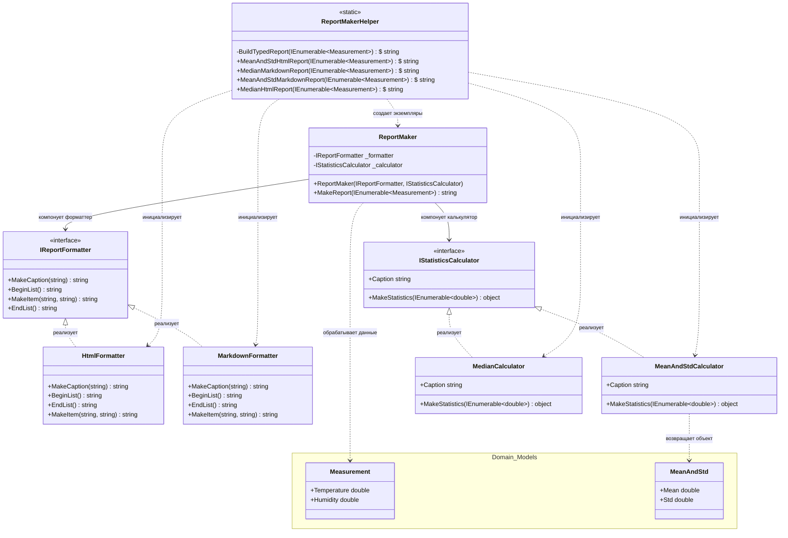

```mermaid
classDiagram
    direction TB

    %% Интерфейсы стратегий
    class IReportFormatter {
        <<interface>>
        +MakeCaption(string) string
        +BeginList() string
        +MakeItem(string, string) string
        +EndList() string
    }

    class IStatisticsCalculator {
        <<interface>>
        +Caption string
        +MakeStatistics(IEnumerable~double~) object
    }

    %% Реализации форматирования
    class HtmlFormatter {
        +MakeCaption(string) string
        +BeginList() string
        +EndList() string
        +MakeItem(string, string) string
    }
    IReportFormatter <|.. HtmlFormatter : <small>реализует</small>

    class MarkdownFormatter {
        +MakeCaption(string) string
        +BeginList() string
        +EndList() string
        +MakeItem(string, string) string
    }
    IReportFormatter <|.. MarkdownFormatter : <small>реализует</small>

    %% Реализации калькулятора
    class MeanAndStdCalculator {
        +Caption string
        +MakeStatistics(IEnumerable~double~) object
    }
    IStatisticsCalculator <|.. MeanAndStdCalculator : <small>реализует</small>

    class MedianCalculator {
        +Caption string
        +MakeStatistics(IEnumerable~double~) object
    }
    IStatisticsCalculator <|.. MedianCalculator : <small>реализует</small>

    %% Вспомогательные структуры и модели данных
    namespace Domain_Models {
        class Measurement {
            +Temperature double
            +Humidity double
        }
        class MeanAndStd {
            +Mean double
            +Std double
        }
    }
    MeanAndStdCalculator ..> MeanAndStd : <small>возвращает объект</small>

    %% Основной класс генератора отчетов
    class ReportMaker {
        -IReportFormatter _formatter
        -IStatisticsCalculator _calculator
        +ReportMaker(IReportFormatter, IStatisticsCalculator)
        +MakeReport(IEnumerable~Measurement~) string
    }
    ReportMaker --> IReportFormatter : <small>компонует форматтер</small>
    ReportMaker --> IStatisticsCalculator : <small>компонует калькулятор</small>
    ReportMaker ..> Measurement : <small>обрабатывает данные</small>

    %% Вспомогательный класс фабрики
    class ReportMakerHelper {
        <<static>>
        -BuildTypedReport(IEnumerable~Measurement~)\$ string
        +MeanAndStdHtmlReport(IEnumerable~Measurement~)\$ string
        +MedianMarkdownReport(IEnumerable~Measurement~)\$ string
        +MeanAndStdMarkdownReport(IEnumerable~Measurement~)\$ string
        +MedianHtmlReport(IEnumerable~Measurement~)\$ string
    }
    ReportMakerHelper ..> ReportMaker : <small>создает экземпляры</small>
    ReportMakerHelper ..> HtmlFormatter : <small>инициализирует</small>
    ReportMakerHelper ..> MarkdownFormatter : <small>инициализирует</small>
    ReportMakerHelper ..> MeanAndStdCalculator : <small>инициализирует</small>
    ReportMakerHelper ..> MedianCalculator : <small>инициализирует</small>
```
