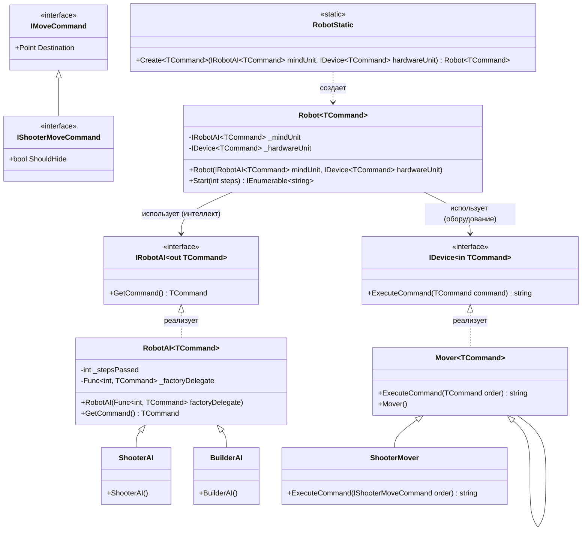

```mermaid
classDiagram
    %% --- ИНТЕРФЕЙСЫ И КОМАНДЫ ---
    class IRobotAI~out TCommand~ {
        <<interface>>
        +GetCommand() TCommand
    }
    
    class IDevice~in TCommand~ {
        <<interface>>
        +ExecuteCommand(TCommand command) string
    }

    class IMoveCommand {
        <<interface>>
        +Point Destination
    }
    
    class IShooterMoveCommand {
        <<interface>>
        +bool ShouldHide
    }
    IMoveCommand <|-- IShooterMoveCommand

    %% --- КОМПОНЕНТЫ ИИ ---
    class RobotAI~TCommand~ {
        -int _stepsPassed
        -Func~int, TCommand~ _factoryDelegate
        +RobotAI(Func~int, TCommand~ factoryDelegate)
        +GetCommand() TCommand
    }
    IRobotAI~TCommand~ <|.. RobotAI~TCommand~ : реализует

    class ShooterAI {
        +ShooterAI()
    }
    RobotAI~ShooterCommand~ <|-- ShooterAI

    class BuilderAI {
        +BuilderAI()
    }
    RobotAI~BuilderCommand~ <|-- BuilderAI

    %% --- ЖЕЛЕЗО И УСТРОЙСТВА ---
    class Mover~TCommand~ {
        +ExecuteCommand(TCommand order) string
    }
    IDevice~TCommand~ <|.. Mover~TCommand~ : реализует

    class Mover {
        +Mover()
    }
    Mover~IMoveCommand~ <|-- Mover

    class ShooterMover {
        +ExecuteCommand(IShooterMoveCommand order) string
    }
    Mover~IShooterMoveCommand~ <|-- ShooterMover

    %% --- СИСТЕМА РОБОТА ---
    class Robot~TCommand~ {
        -IRobotAI~TCommand~ _mindUnit
        -IDevice~TCommand~ _hardwareUnit
        +Robot(IRobotAI~TCommand~ mindUnit, IDevice~TCommand~ hardwareUnit)
        +Start(int steps) IEnumerable~string~
    }

    class RobotStatic {
        <<static>>
        +Create~TCommand~(IRobotAI~TCommand~ mindUnit, IDevice~TCommand~ hardwareUnit) Robot~TCommand~
    }
    
    Robot~TCommand~ --> IRobotAI~TCommand~ : использует (интеллект)
    Robot~TCommand~ --> IDevice~TCommand~ : использует (оборудование)
    RobotStatic ..> Robot~TCommand~ : создает
```
