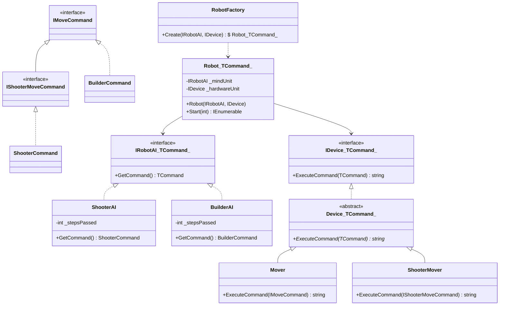

```mermaid
classDiagram
    direction TB

    %% 1. Иерархия интерфейсов и команд
    class IMoveCommand { <<interface>> }
    class IShooterMoveCommand { <<interface>> }
    class ShooterCommand
    class BuilderCommand
    
    IMoveCommand <|-- IShooterMoveCommand
    IShooterMoveCommand <|.. ShooterCommand
    IMoveCommand <|.. BuilderCommand

    %% 2. Обобщенные контракты (Строго с дженериками в именах классов)
    class IRobotAI_TCommand_ {
        <<interface>>
        +GetCommand() TCommand
    }
    class IDevice_TCommand_ {
        <<interface>>
        +ExecuteCommand(TCommand) string
    }

    %% 3. Реализации Искусственного Интеллекта
    class ShooterAI {
        -int _stepsPassed
        +GetCommand() ShooterCommand
    }
    class BuilderAI {
        -int _stepsPassed
        +GetCommand() BuilderCommand
    }
    IRobotAI_TCommand_ <|.. ShooterAI
    IRobotAI_TCommand_ <|.. BuilderAI

    %% 4. Реализации Устройств-Исполнителей (Через абстрактный класс)
    class Device_TCommand_ {
        <<abstract>>
        +ExecuteCommand(TCommand) string*
    }
    IDevice_TCommand_ <|.. Device_TCommand_

    class Mover {
        +ExecuteCommand(IMoveCommand) string
    }
    class ShooterMover {
        +ExecuteCommand(IShooterMoveCommand) string
    }
    Device_TCommand_ <|-- Mover
    Device_TCommand_ <|-- ShooterMover

    %% 5. Главный управляющий класс и Фабрика
    class Robot_TCommand_ {
        -IRobotAI _mindUnit
        -IDevice _hardwareUnit
        +Robot(IRobotAI, IDevice)
        +Start(int) IEnumerable
    }
    Robot_TCommand_ --> IRobotAI_TCommand_
    Robot_TCommand_ --> IDevice_TCommand_

    class RobotFactory {
        +Create(IRobotAI, IDevice)\$ Robot_TCommand_
    }
    RobotFactory ..> Robot_TCommand_
```
