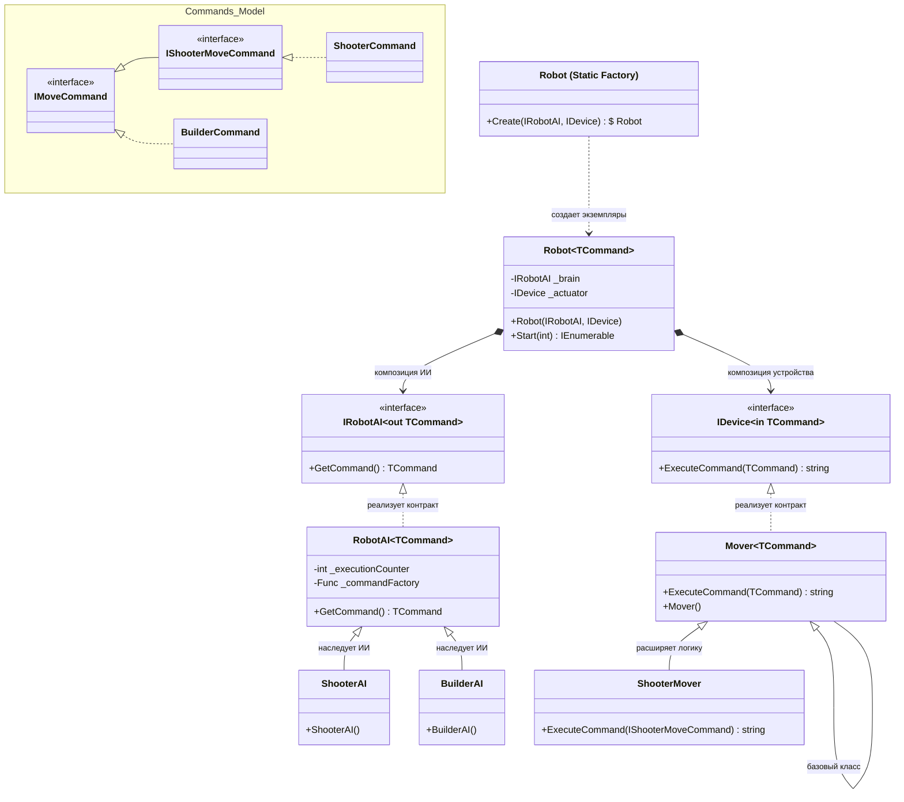

```mermaid
classDiagram
    direction TB

    %% Системные интерфейсы и команды 
    namespace Commands_Model {
        class IMoveCommand { <<interface>> }
        class IShooterMoveCommand { <<interface>> }
        class ShooterCommand
        class BuilderCommand
    }
    IMoveCommand <|-- IShooterMoveCommand
    IShooterMoveCommand <|.. ShooterCommand
    IMoveCommand <|.. BuilderCommand

    %% Базовые обобщенные контракты устройств и ИИ
    class IRobotAI~out TCommand~ {
        <<interface>>
        +GetCommand() TCommand
    }
    class IDevice~in TCommand~ {
        <<interface>>
        +ExecuteCommand(TCommand) string
    }

    %% Новая обобщенная логика 
    class RobotAI~TCommand~ {
        -int _executionCounter
        -Func _commandFactory
        +GetCommand() TCommand
    }
    IRobotAI <|.. RobotAI : <small>реализует контракт</small>

    class Mover~TCommand~ {
        +ExecuteCommand(TCommand) string
    }
    IDevice <|.. Mover : <small>реализует контракт</small>

    %% Наследники конкретных реализаций
    class ShooterAI { +ShooterAI() }
    class BuilderAI { +BuilderAI() }
    RobotAI <|-- ShooterAI : <small>наследует ИИ</small>
    RobotAI <|-- BuilderAI : <small>наследует ИИ</small>

    class Mover { +Mover() }
    class ShooterMover { +ExecuteCommand(IShooterMoveCommand) string }
    Mover <|-- Mover : <small>базовый класс</small>
    Mover <|-- ShooterMover : <small>расширяет логику</small>

    %% Главный класс Робота и Фабрика вывода типов
    class Robot~TCommand~ {
        -IRobotAI _brain
        -IDevice _actuator
        +Robot(IRobotAI, IDevice)
        +Start(int) IEnumerable
    }
    Robot *--> IRobotAI : <small>композиция ИИ</small>
    Robot *--> IDevice : <small>композиция устройства</small>

    class RobotFactory["Robot (Static Factory)"] {
        +Create(IRobotAI, IDevice)\$ Robot
    }
    RobotFactory ..> Robot : <small>создает экземпляры</small>
```
