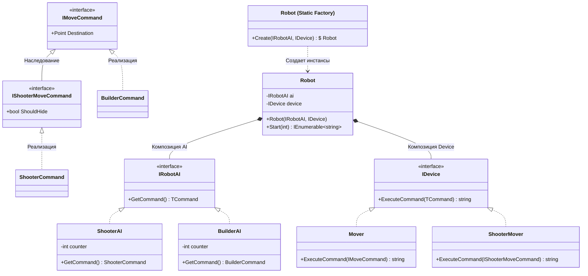

```mermaid
classDiagram
    class IMoveCommand {
        <<interface>>
        +Point Destination
    }
    class IShooterMoveCommand {
        <<interface>>
        +bool ShouldHide
    }
    IMoveCommand <|-- IShooterMoveCommand : Наследование

    class ShooterCommand
    class BuilderCommand

    IShooterMoveCommand <|.. ShooterCommand : Реализация
    IMoveCommand <|.. BuilderCommand : Реализация

    class IRobotAI {
        <<interface>>
        +GetCommand() TCommand
    }
    class IDevice {
        <<interface>>
        +ExecuteCommand(TCommand) string
    }

    class ShooterAI {
        -int counter
        +GetCommand() ShooterCommand
    }
    IRobotAI <|.. ShooterAI

    class BuilderAI {
        -int counter
        +GetCommand() BuilderCommand
    }
    IRobotAI <|.. BuilderAI

    class Mover {
        +ExecuteCommand(IMoveCommand) string
    }
    IDevice <|.. Mover

    class ShooterMover {
        +ExecuteCommand(IShooterMoveCommand) string
    }
    IDevice <|.. ShooterMover

    %% Главный класс Робота
    class Robot {
        -IRobotAI ai
        -IDevice device
        +Robot(IRobotAI, IDevice)
        +Start(int) IEnumerable~string~
    }
    Robot *-- IRobotAI : Композиция AI
    Robot *-- IDevice : Композиция Device

    
    class RobotFactory["Robot (Static Factory)"] {
        +Create(IRobotAI, IDevice)\$ Robot
    }
    RobotFactory ..> Robot : Создает инстансы
```
