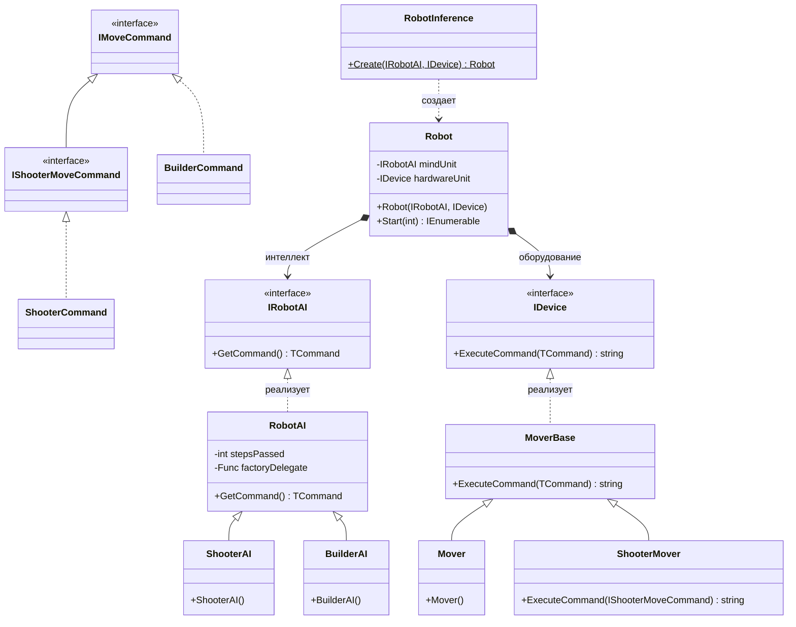

```mermaid
classDiagram
    direction TB

    %% Инфраструктурные интерфейсы команд
    class IMoveCommand { <<interface>> }
    class IShooterMoveCommand { <<interface>> }
    class ShooterCommand
    class BuilderCommand
    
    IMoveCommand <|-- IShooterMoveCommand
    IShooterMoveCommand <|.. ShooterCommand
    IMoveCommand <|.. BuilderCommand

    %% Базовые интерфейсы ИИ и Устройств
    class IRobotAI {
        <<interface>>
        +GetCommand() TCommand
    }
    class IDevice {
        <<interface>>
        +ExecuteCommand(TCommand) string
    }

    %% Обобщенная логика
    class RobotAI {
        -int stepsPassed
        -Func factoryDelegate
        +GetCommand() TCommand
    }
    IRobotAI <|.. RobotAI : реализует

    class MoverBase {
        +ExecuteCommand(TCommand) string
    }
    IDevice <|.. MoverBase : реализует

    %% Реализации ИИ
    class ShooterAI { +ShooterAI() }
    class BuilderAI { +BuilderAI() }
    RobotAI <|-- ShooterAI
    RobotAI <|-- BuilderAI

    %% Реализации Устройств
    class Mover { +Mover() }
    class ShooterMover { +ExecuteCommand(IShooterMoveCommand) string }
    MoverBase <|-- Mover
    MoverBase <|-- ShooterMover

    %% Главный класс Робота
    class Robot {
        -IRobotAI mindUnit
        -IDevice hardwareUnit
        +Robot(IRobotAI, IDevice)
        +Start(int) IEnumerable
    }
    Robot *--> IRobotAI : интеллект
    Robot *--> IDevice : оборудование

    %% Статический метод фабрики без экранирования
    class RobotInference {
        +Create(IRobotAI, IDevice)$ Robot
    }
    RobotInference ..> Robot : создает
```
