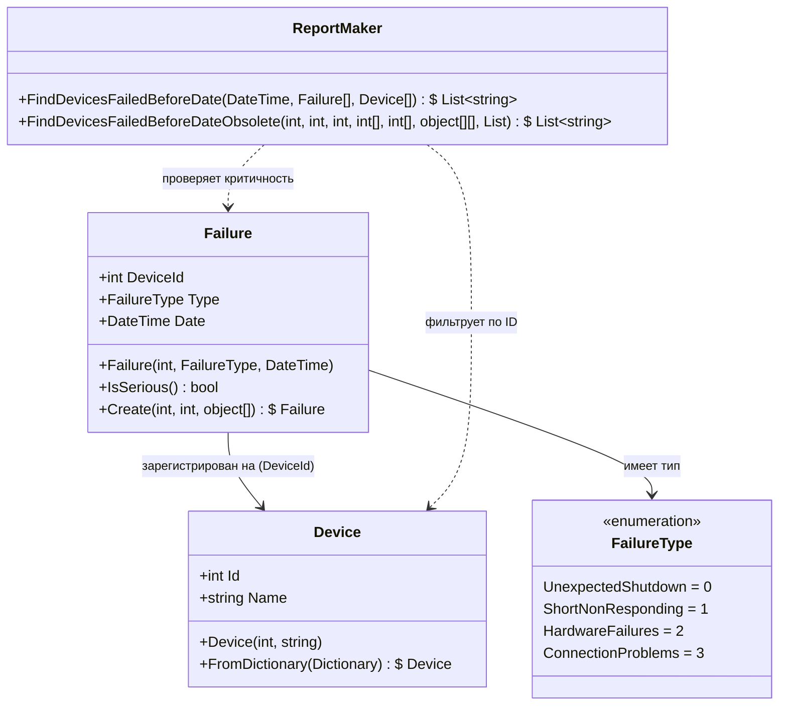

```mermaid
classDiagram
    direction TB

    %% Определение перечисления
    class FailureType {
        <<enumeration>>
        UnexpectedShutdown = 0
        ShortNonResponding = 1
        HardwareFailures = 2
        ConnectionProblems = 3
    }

    %% Определение классов
    class Device {
        +int Id
        +string Name
        +Device(int, string)
        +FromDictionary(Dictionary)\$ Device
    }

    class Failure {
        +int DeviceId
        +FailureType Type
        +DateTime Date
        +Failure(int, FailureType, DateTime)
        +IsSerious() bool
        +Create(int, int, object[])\$ Failure
    }

    class ReportMaker {
        +FindDevicesFailedBeforeDate(DateTime, Failure[], Device[])\$ List~string~
        +FindDevicesFailedBeforeDateObsolete(int, int, int, int[], int[], object[][], List)\$ List~string~
    }

    %% Структурные связи
    Failure --> FailureType : <small>имеет тип</small>
    Failure --> Device : <small>зарегистрирован на (DeviceId)</small>
    
    %% Зависимости логики обработки
    ReportMaker ..> Device : <small>фильтрует по ID</small>
    ReportMaker ..> Failure : <small>проверяет критичность</small>
```
