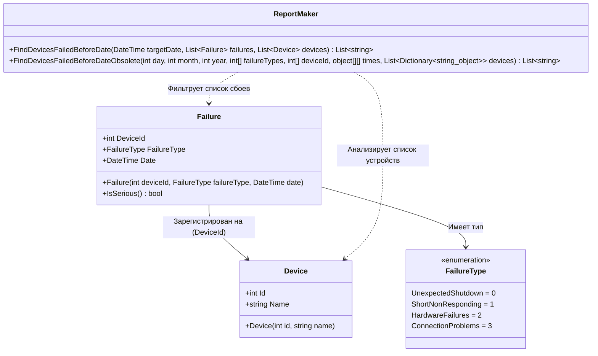

```mermaid
classDiagram
    %% Определение перечисления
    class FailureType {
        <<enumeration>>
        UnexpectedShutdown = 0
        ShortNonResponding = 1
        HardwareFailures = 2
        ConnectionProblems = 3
    }

    %% Определение классов
    class Device {
        +int Id
        +string Name
        +Device(int id, string name)
    }

    class Failure {
        +int DeviceId
        +FailureType FailureType
        +DateTime Date
        +Failure(int deviceId, FailureType failureType, DateTime date)
        +IsSerious() bool
    }

    class ReportMaker {
        +FindDevicesFailedBeforeDate(DateTime targetDate, List~Failure~ failures, List~Device~ devices) List~string~
        +FindDevicesFailedBeforeDateObsolete(int day, int month, int year, int[] failureTypes, int[] deviceId, object[][] times, List~Dictionary~string_object~~ devices) List~string~
    }

    %% Определение связей и структурных отношений
    Failure --> FailureType : Имеет тип
    Failure --> Device : Зарегистрирован на (DeviceId)
    
    %% Зависимости логики (генератор отчетов обрабатывает списки этих сущностей)
    ReportMaker ..> Device : Анализирует список устройств
    ReportMaker ..> Failure : Фильтрует список сбоев
```
