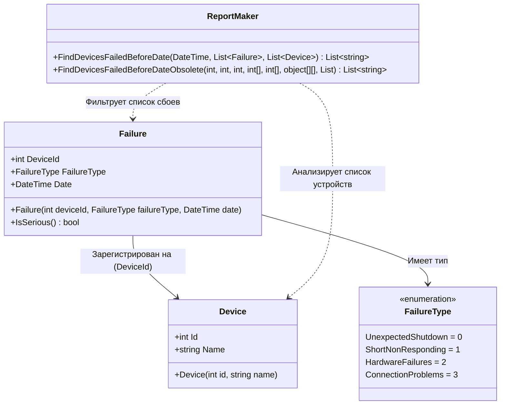

```mermaid
classDiagram
    %% Перечисление
    class FailureType {
        <<enumeration>>
        UnexpectedShutdown = 0
        ShortNonResponding = 1
        HardwareFailures = 2
        ConnectionProblems = 3
    }

    %% Классы
    class Device {
        +int Id
        +string Name
        +Device(int id, string name)
    }

    class Failure {
        +int DeviceId
        +FailureType FailureType
        +DateTime Date
        +Failure(int deviceId, FailureType failureType, DateTime date)
        +IsSerious() bool
    }

    class ReportMaker {
        +FindDevicesFailedBeforeDate(DateTime, List~Failure~, List~Device~) List~string~
        +FindDevicesFailedBeforeDateObsolete(int, int, int, int[], int[], object[][], List) List~string~
    }

    Failure --> FailureType : Имеет тип
    Failure --> Device : Зарегистрирован на (DeviceId)
    
    ReportMaker ..> Device : Анализирует список устройств
    ReportMaker ..> Failure : Фильтрует список сбоев
```
