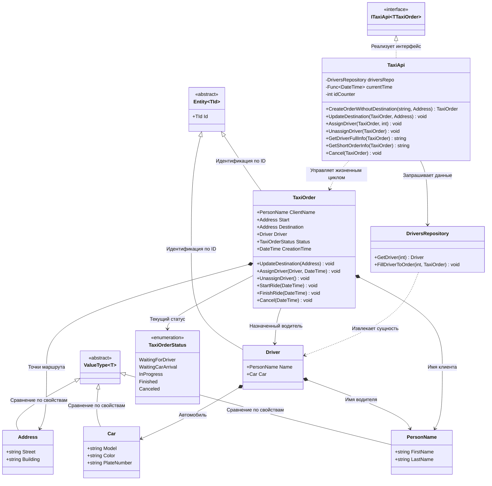

```mermaid
classDiagram
    %% Базовые инфраструктурные классы
    class Entity~TId~ {
        <<abstract>>
        +TId Id
    }
    class ValueType~T~ {
        <<abstract>>
    }

    %% Объекты-значения
    class Car {
        +string Model
        +string Color
        +string PlateNumber
    }
    class PersonName {
        +string FirstName
        +string LastName
    }
    class Address {
        +string Street
        +string Building
    }

    %% Сущности
    class Driver {
        +PersonName Name
        +Car Car
    }

    class TaxiOrder {
        +PersonName ClientName
        +Address Start
        +Address Destination
        +Driver Driver
        +TaxiOrderStatus Status
        +DateTime CreationTime
        +UpdateDestination(Address) void
        +AssignDriver(Driver, DateTime) void
        +UnassignDriver() void
        +StartRide(DateTime) void
        +FinishRide(DateTime) void
        +Cancel(DateTime) void
    }

    %% Перечисления
    class TaxiOrderStatus {
        <<enumeration>>
        WaitingForDriver
        WaitingCarArrival
        InProgress
        Finished
        Canceled
    }

    %% Наследование базовых типов DDD
    Entity <|-- Driver : Идентификация по ID
    Entity <|-- TaxiOrder : Идентификация по ID
    ValueType <|-- Car : Сравнение по свойствам
    ValueType <|-- PersonName : Сравнение по свойствам
    ValueType <|-- Address : Сравнение по свойствам

    %% Композиция и агрегация внутренних свойств
    Driver *--> PersonName : Имя водителя
    Driver *--> Car : Автомобиль
    TaxiOrder *--> PersonName : Имя клиента
    TaxiOrder *--> Address : Точки маршрута
    TaxiOrder --> Driver : Назначенный водитель
    TaxiOrder --> TaxiOrderStatus : Текущий статус

    %% Сервисы и интерфейсы
    class ITaxiApi~TTaxiOrder~ {
        <<interface>>
    }

    class DriversRepository {
        +GetDriver(int) Driver
        +FillDriverToOrder(int, TaxiOrder) void
    }

    class TaxiApi {
        -DriversRepository driversRepo
        -Func~DateTime~ currentTime
        -int idCounter
        +CreateOrderWithoutDestination(string, Address) TaxiOrder
        +UpdateDestination(TaxiOrder, Address) void
        +AssignDriver(TaxiOrder, int) void
        +UnassignDriver(TaxiOrder) void
        +GetDriverFullInfo(TaxiOrder) string
        +GetShortOrderInfo(TaxiOrder) string
        +Cancel(TaxiOrder) void
    }

    %% Зависимости управления cервисами
    ITaxiApi <|.. TaxiApi : Реализует интерфейс
    TaxiApi --> DriversRepository : Запрашивает данные
    TaxiApi ..> TaxiOrder : Управляет жизненным циклом
    DriversRepository ..> Driver : Извлекает сущность
```
