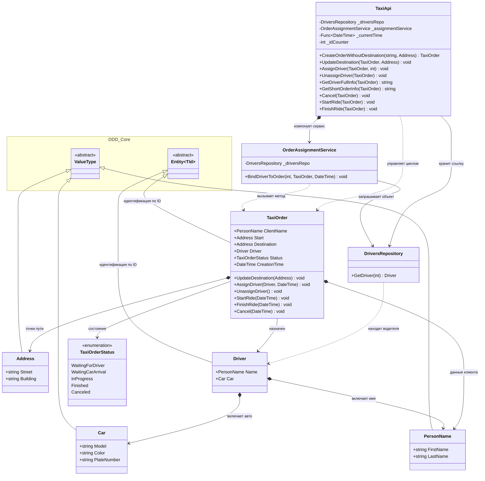

```mermaid
classDiagram
    direction TB

    %% Базовая инфраструктура
    namespace DDD_Core {
        class Entity~TId~ { <<abstract>> }
        class ValueType { <<abstract>> }
    }

    %% Объекты-значения 
    class Car {
        +string Model
        +string Color
        +string PlateNumber
    }
    class PersonName {
        +string FirstName
        +string LastName
    }
    class Address {
        +string Street
        +string Building
    }
    ValueType <|-- Car
    ValueType <|-- PersonName
    ValueType <|-- Address

    %% Доменные Сущности 
    class Driver {
        +PersonName Name
        +Car Car
    }

    class TaxiOrder {
        +PersonName ClientName
        +Address Start
        +Address Destination
        +Driver Driver
        +TaxiOrderStatus Status
        +DateTime CreationTime
        +UpdateDestination(Address) void
        +AssignDriver(Driver, DateTime) void
        +UnassignDriver() void
        +StartRide(DateTime) void
        +FinishRide(DateTime) void
        +Cancel(DateTime) void
    }
    Entity <|-- Driver : <small>идентификация по ID</small>
    Entity <|-- TaxiOrder : <small>идентификация по ID</small>

    %% Жизненный цикл
    class TaxiOrderStatus {
        <<enumeration>>
        WaitingForDriver
        WaitingCarArrival
        InProgress
        Finished
        Canceled
    }

    %% Слои бизнес-логики и сервисов
    class DriversRepository {
        +GetDriver(int) Driver
    }

    class OrderAssignmentService {
        -DriversRepository _driversRepo
        +BindDriverToOrder(int, TaxiOrder, DateTime) void
    }

    class TaxiApi {
        -DriversRepository _driversRepo
        -OrderAssignmentService _assignmentService
        -Func~DateTime~ _currentTime
        -int _idCounter
        +CreateOrderWithoutDestination(string, Address) TaxiOrder
        +UpdateDestination(TaxiOrder, Address) void
        +AssignDriver(TaxiOrder, int) void
        +UnassignDriver(TaxiOrder) void
        +GetDriverFullInfo(TaxiOrder) string
        +GetShortOrderInfo(TaxiOrder) string
        +Cancel(TaxiOrder) void
        +StartRide(TaxiOrder) void
        +FinishRide(TaxiOrder) void
    }

    %% Отношения агрегации внутри Домена
    Driver *--> Car : <small>включает авто</small>
    Driver *--> PersonName : <small>включает имя</small>
    TaxiOrder *--> PersonName : <small>данные клиента</small>
    TaxiOrder *--> Address : <small>точки пути</small>
    TaxiOrder --> Driver : <small>назначен</small>
    TaxiOrder --> TaxiOrderStatus : <small>состояние</small>

    %% Aрхитектура связей
    DriversRepository ..> Driver : <small>находит водителя</small>
    OrderAssignmentService --> DriversRepository : <small>запрашивает объект</small>
    OrderAssignmentService ..> TaxiOrder : <small>вызывает метод</small>

    %% Инкапсуляция фасада API
    TaxiApi --> DriversRepository : <small>хранит ссылку</small>
    TaxiApi *--> OrderAssignmentService : <small>компонует сервис</small>
    TaxiApi ..> TaxiOrder : <small>управляет циклом</small>
```
